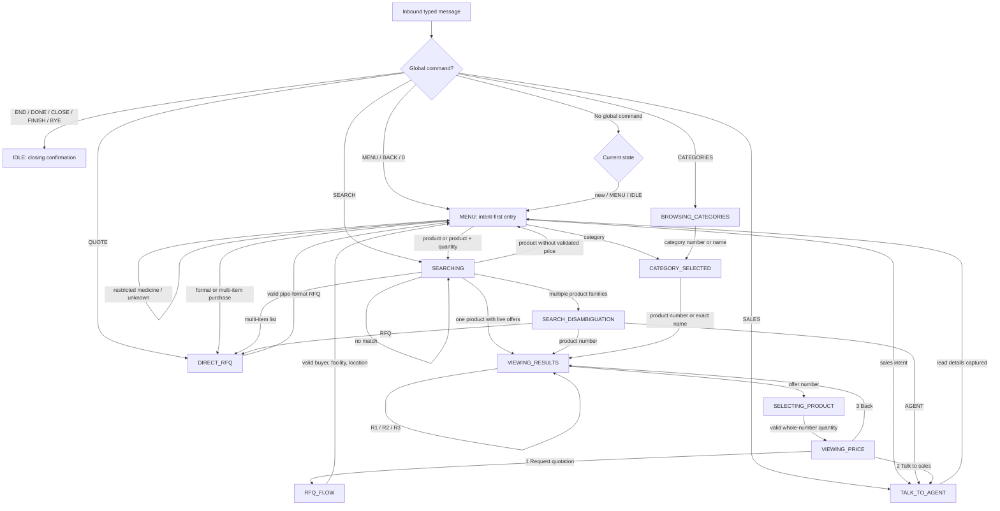

# SocioMED WhatsApp conversation logic

This document is the product and copy map for the buyer conversation implemented in `app/services/whatsapp_service.py`.

## Editing SocioMED's business language

All buyer-facing static wording is in `app/content/conversation_copy.json`. Edit the JSON values, but do not rename keys or remove placeholders such as `{rfq_id}` or `{product_name}`. JSON requires double quotes and escaped line breaks (`\n`). A Render deploy or process restart is required before edited copy is reloaded.

For a scenario-by-scenario reading view of all 79 messages, including the dynamic supplier and sales formats, use `docs/WHATSAPP_RESPONSE_COPY.md`.

The copy loader deliberately fails on an unknown key or missing placeholder. This makes a broken template visible in tests instead of silently sending incomplete buyer messages.

## Global commands and decision priority

Every typed message is processed in this order:

1. Confirm a sender and extract typed text. Photos, documents, locations, voice notes, and other unsupported message types receive `unsupported_message`; the current session is preserved.
2. Load and validate the current session state.
3. Intercept a session-closing command from any state: `END`, `DONE`, `CLOSE`, `CLOSE SESSION`, `FINISH`, `BYE`, or `GOODBYE`.
4. On a close command, save state `IDLE`, record the audit/funnel event, and send `conversation_closed`.
5. Validate message length and characters.
6. Intercept `0`, `M`, `MENU`, or `BACK` and return to `MENU`.
7. During an active flow, intercept `SEARCH`, `CATEGORIES`, `QUOTE`, or `SALES` and move directly to that flow.
8. In `MENU`, `IDLE`, or a brand-new session, classify the buyer's intent.
9. Otherwise, process the response expected by the current state.

`STOP` is intentionally not a SocioMED session command. Twilio and WhatsApp may treat it as a messaging opt-out keyword, so repurposing it could create compliance and delivery confusion.

After `END`, the next normal message is treated as a new entry because `IDLE` uses the same intent-first routing as a new session.

## State flow



## State-by-state behavior

| State | The bot expects | Success transition | Invalid or unavailable behavior |
|---|---|---|---|
| `MENU` | A greeting, product, category, quote/RFQ request, sales request, or numbered navigation | Routes to the relevant flow | Explains valid entry choices and stays in `MENU` |
| `IDLE` | Any new buyer message | Re-enters intent-first `MENU` behavior | Same as a new conversation |
| `SEARCHING` | One product phrase, optionally with quantity | One match goes to `VIEWING_RESULTS`; several families go to `SEARCH_DISAMBIGUATION`; a list goes to `DIRECT_RFQ` | A missing match stays in search; a product without a validated price offers RFQ/sales routing |
| `SEARCH_DISAMBIGUATION` | Product number, `RFQ`, or `AGENT` | Product number goes to offers; commands go to RFQ or sales | Repeats the numbered-choice instruction |
| `BROWSING_CATEGORIES` | Category number or exact/fuzzy category name | `CATEGORY_SELECTED` | Repeats valid category-selection instructions |
| `CATEGORY_SELECTED` | Product number or exact/fuzzy product name | `VIEWING_RESULTS` | Stays in the category if selection or live pricing is unavailable |
| `VIEWING_RESULTS` | Supplier offer number or related product code `R1`–`R3` | Offer goes to `SELECTING_PRODUCT`; related product refreshes `VIEWING_RESULTS` | Repeats valid offer-selection instructions |
| `SELECTING_PRODUCT` | Whole-number quantity meeting the minimum | `VIEWING_PRICE` | Explains integer, positive, or minimum-quantity requirement |
| `VIEWING_PRICE` | `1`, `2`, `3`, or global `0` | Goes to `RFQ_FLOW`, `TALK_TO_AGENT`, `VIEWING_RESULTS`, or `MENU` | Repeats the four valid choices |
| `RFQ_FLOW` | Contact name, facility/client name, and delivery location | Creates an RFQ, notifies supplier/sales, then returns to `MENU` | Repeats the example or reports a temporary submission failure |
| `DIRECT_RFQ` | A pipe-delimited single or bulk RFQ | Creates and routes the RFQ, then returns to `MENU` | Repeats accepted formats or reports invalid fields/submission failure |
| `TALK_TO_AGENT` | `name | organization | what you need` | Creates a buyer lead, alerts sales, then returns to `MENU` | Reports a temporary handoff failure |

## New-session intent classification

The classifier applies this precedence so an ambiguous sentence has one deterministic route:

1. Navigation aliases (`0`, `1`, `2`, `3`, `4`, `MENU`, `SEARCH`, `CATEGORIES`, `QUOTE`, `RFQ`, `SALES`).
2. Restricted medicine terms.
3. Sales/human-help language.
4. Formal purchase/RFQ language.
5. Multi-item catalog requests.
6. Greetings.
7. Category requests.
8. Product with quantity.
9. Product without quantity.
10. Unknown input.

SocioMED currently supports medical supplies and equipment, not medicines. English is the only implemented conversation language; `_detect_language` is still a placeholder.

## Search and offer logic

Search uses normalized text, selected singular/plural equivalents, pipe-separated aliases, product name, speciality, category, family ID, inventory brand, and SKU. Exact and substring matches receive the highest weights; fuzzy token matching handles spelling variation.

Results are deduplicated by `product_family_id` (falling back to normalized product name). When several rows represent the same family, the representative with a validated positive price is preferred. The same mechanism applies catalog-wide: a family is the buyer-recognizable product type, while clinical specialties are separate many-to-many search facets. Controlled suture families currently receive buyer-friendly labels such as “PGA sutures” and “Chromic catgut sutures.”

The current family behavior improves discovery but does not yet aggregate every size, gauge, lumen, material, length, or supplier variant into a family detail screen. The proposed catalog-wide family and specialty schema is in `outputs/sociomed_taxonomy_review_20260906/sociomed_catalog_taxonomy_review.xlsx`; it must be approved before production activation.

An offer is shown only when all three links resolve: product → inventory → vendor, and the inventory row has at least one pricing tier. Prices are presented as estimates; availability and delivery timing are confirmed in the quotation.

## Copy-key inventory

The JSON file is the complete source of buyer-facing static copy. Keys are grouped here for safe editing:

Every outbound WhatsApp message is passed through `brand_whatsapp_message`. If the exact wordmark `SocioMED` is absent, the sender appends a blank line and `— SocioMED`. Messages that already contain the exact wordmark are not given a duplicate signature.

| Area | Copy keys |
|---|---|
| Session and navigation | `main_menu`, `help`, `conversation_closed`, `unknown_state`, `message_too_long`, `unsupported_message` |
| Entry and prompts | `search_prompt`, `sales_prompt`, `sales_prompt_short`, `sales_handoff_prompt`, `entry_fallback`, `restricted_medicine`, `returning_greeting`, `returning_rfq` |
| Categories and featured offers | `no_featured_offers`, `featured_header`, `featured_offer`, `featured_footer`, `no_categories`, `categories_header`, `categories_footer`, `category_empty`, `category_products_header`, `category_products_overflow`, `category_products_footer` |
| Search and disambiguation | `bulk_detected`, `bulk_complex`, `search_invalid`, `search_no_match`, `search_no_live_offer_menu`, `search_no_live_offer_rfq`, `requested_quantity`, `ambiguous_header`, `ambiguous_next_large`, `ambiguous_next_small`, `disambiguation_invalid` |
| Category selection | `category_invalid`, `category_product_invalid`, `category_no_live_offer` |
| Offers and related products | `results_empty`, `results_header`, `result_title`, `result_sku`, `result_summary`, `result_availability`, `results_footer`, `availability_in_stock`, `availability_sourcing`, `related_header`, `related_offer`, `related_footer`, `related_invalid`, `related_missing`, `related_no_live_offer`, `offer_number_prompt`, `offer_selected`, `offer_invalid` |
| Quantity and price | `quantity_integer`, `quantity_positive`, `quantity_below_minimum`, `price_menu`, `returning_to_offers`, `price_menu_invalid` |
| RFQ | `direct_rfq_prompt`, `rfq_contact_prompt`, `rfq_submit_error`, `supplier_notified`, `supplier_manual`, `rfq_received`, `direct_rfq_invalid_format`, `direct_rfq_invalid_data`, `direct_rfq_submit_error`, `bulk_rfq_received`, `direct_rfq_received` |
| Sales and follow-up | `sales_handoff_error`, `sales_handoff_received`, `buyer_status_confirmed`, `buyer_status_fulfilled`, `worker_failure` |

## Supported placeholders

Preserve these placeholders wherever they already occur: `{message_type}`, `{index}`, `{product_name}`, `{brand}`, `{vendor_name}`, `{price_text}`, `{uom}`, `{stock_qty}`, `{lead_time_days}`, `{category_name}`, `{first_name}`, `{menu}`, `{organization}`, `{delivery_location}`, `{prompt}`, `{quantity}`, `{results}`, `{sku_line}`, `{min_qty}`, `{minimum_quantity}`, `{routing_message}`, `{rfq_id}`, `{lead_id}`, `{counter}`, `{sku}`, `{price_range}`, and `{availability}`.

## Verification after copy changes

Run:

```bash
pytest tests/test_conversation_copy.py tests/test_whatsapp_service.py tests/test_formatter.py tests/test_rfq_triage.py
```

Then test at least `hello`, `sutures`, a numbered offer, an RFQ, `END`, and a new message after `END` through the Twilio Sandbox.
